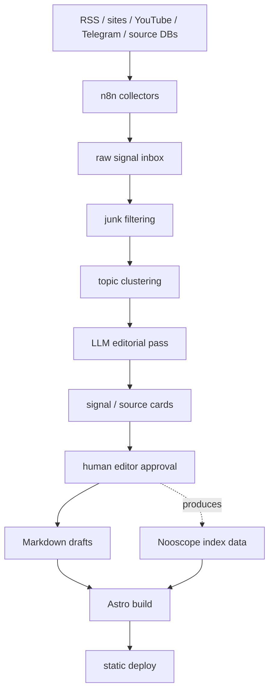

# System architecture

## Overview

The system has three layers that must stay conceptually separate:

1. **Astro static publication layer** — renders issues as journal pages. Content-first: pages assemble from Markdown/MDX, TypeScript data files, and point interactive components. Ships as fast static HTML with no mandatory backend. See [[astro-publication-layer]].
2. **Nooscope** — the in-universe editorial instrument that reads cultural signals for an issue (source corpus → motifs → indices → editorial scoring → explanation cards → interactive panel). It is not a statistics tool or a fortune-telling device. See [[nooscope-machine]].
3. **n8n editorial machine** — the automation/collection layer that feeds raw signal material toward Nooscope cards and Continuum drafts, always passing through human editorial approval before becoming published Markdown. **This is the current implementation focus** (as of 2026-07-07), ahead of the Astro static shell in actual build order. See [[n8n-editorial-machine]].

НООСФЕРА itself — the magazine concept binding these three layers together — is documented in [[noosphere-concept]].

## Module graph

## Constraints

- Site must be deployable without a server (GitHub Pages / Cloudflare Pages / Netlify / Vercel).
- Content lives in Markdown/MDX/JSON/TS data files, versioned in Git — each issue is a folder.
- No CMS at the start (Ghost/WordPress/Notion-as-CMS) — see [[astro-publication-layer]] and root stack for why.
- Human approval is a hard architectural gate between the n8n/LLM pipeline and anything published — see [[editorial-boundaries]]. The pipeline may draft; it may not publish.
- No legally risky assets (no OMNI scans as primary visuals, no unrighted film stills, no borrowed music, no unauthorized translations of protected fiction, no AI images passed off as archival documents) — see [[editorial-boundaries]].
