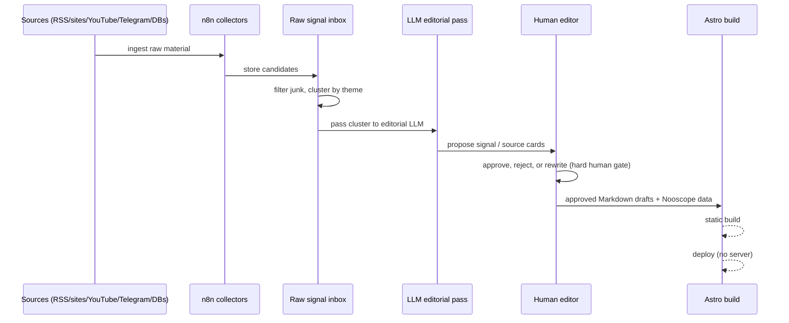
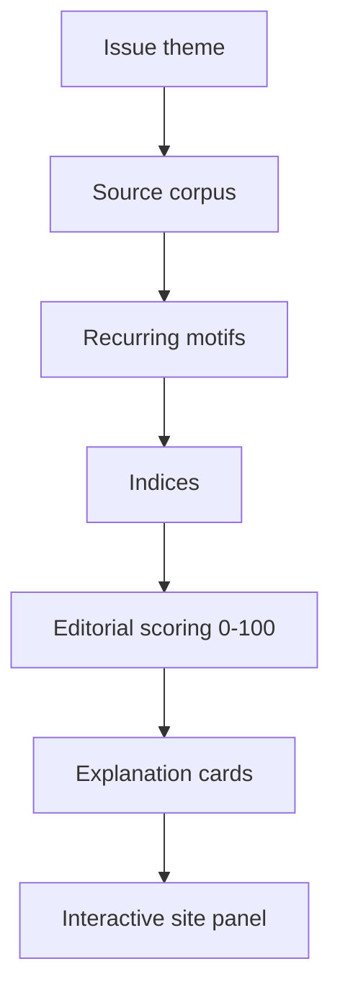

# Key flows

## End-to-end path: editorial automation (n8n → published issue)

This is the core flow of the [[n8n-editorial-machine]] — the current implementation focus.



Nothing crosses from `Ed` to `Astro` without explicit human approval — see [[editorial-boundaries]]. Before n8n is wired up, this same path is walked entirely by hand: NotebookLM → Markdown → Astro.

What n8n automates first (draft stage only): source collection for `CONTINUUM`, source card drafts, Nooscope signal candidates, Reading Room drafts, a weekly radar for future issues.

## Other important flows

### Reader path through an issue

```mermaid
graph LR
  Home[/ manifesto] --> IssueLanding[/issue/001 thesis]
  IssueLanding --> FirstWord[FIRST WORD]
  FirstWord --> Rubrics[CONTINUUM / Machine Dreams / Abandoned Habitats / Residual Media]
  Rubrics --> Nooscope[Nooscope panel: Domestic Haunting Index]
  Nooscope --> Fiction[Night Fiction]
  Fiction --> LastPage[Last Page]
  LastPage --> Blackout[Residue: click to blackout]
```

### Nooscope signal formation



See [[nooscope-machine]] for the scoring rubric and card structure.
