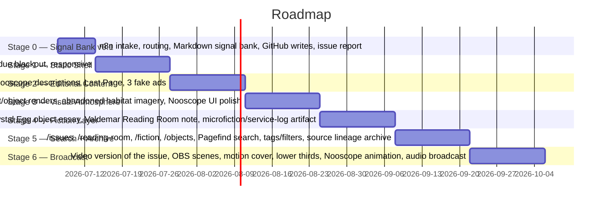

# Roadmap

## Milestones

**Current status (2026-07-08): actual build order departs from the strategy doc's Stage 1.** The active implementation focus is the [[n8n-editorial-machine]] and its [[nooscope-machine]] Signal Bank, not the Astro static shell. [[astro-publication-layer]] remains the publication layer and Stage 1 target, just not the current work.

The live n8n workflow now writes Markdown signal cards into GitHub under `signals/<issue-id>/...` and produces an issue readiness report. This creates a new pre-Astro phase: **Signal Bank v0.1**.

## Current phase — Signal Bank v0.1

Goal: turn incoming feeds into a versioned editorial bank for future issues.

Implemented:

1. source seed list;
2. RSS read;
3. normalization;
4. meta/news rejection;
5. initial Nooscope scoring;
6. strong-signal filtering;
7. issue routing across future issue buckets;
8. Mistral editorial analysis;
9. Markdown finalization;
10. editorial decision statuses;
11. GitHub write into `signals/`;
12. issue readiness report.

Next work inside this phase:

1. export the n8n workflow JSON into `n8n/workflows/`;
2. document credentials and setup in `n8n/notes/`;
3. add duplicate detection / update-or-skip before GitHub writes;
4. move issue definitions and routing dictionaries out of node code into versioned repo data;
5. add a `sources.yml` or equivalent source catalogue;
6. tighten the LLM prompt so most materials are not marked as features;
7. add a human-review workflow for promoted candidates.

## Strategy-doc stages

The strategy doc defines six publication stages after / alongside the Signal Bank work:

Stage durations above are placeholders (2-week slices) — the doc gives ordering and scope, not dates.

## First practical action after Signal Bank v0.1

Repo `noosphere`, milestone `NOOSPHERE 001 / STATIC SHELL`:

1. `npm create astro@latest`
2. base structure `src/content/issues/001`
3. `BaseLayout` / `IssueLayout` / `RubricLayout`
4. the 7 MVP pages
5. `global.css` visual system
6. `NooscopePanel` on static data
7. `ResidueButton`
8. test build
9. deploy to GitHub Pages or Cloudflare Pages

Text-writing and placeholder-graphic replacement begin only after this shell exists, but the `signals/` bank can keep accumulating material in parallel.

## MVP backlog scope (per strategy doc section 17)

- **Must have**: Astro static site, home, Issue 001 landing, 7 MVP routes, content data model, IssueNav, NooscopePanel, dark glossy CSS system, source lineage blocks, no copyrighted assets, deployed static build.
- **Should have**: fake ads, sound toggle, canvas noise, signal ticker, residue blackout, responsive mobile, basic SEO metadata.
- **Could have**: Pagefind search, visual archive, real audio loops, fiction page, object page, reading room, RSS feed, PDF/zine export.
- **Not now**: CMS, accounts, comments, payments, heavy 3D, complex backend, full automation without editor approval — see [[editorial-boundaries]].
