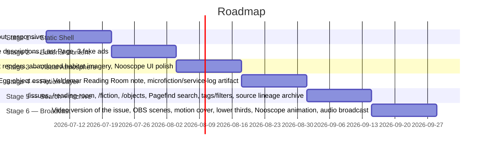

# Roadmap

## Milestones

**Current status (2026-07-07): actual build order departs from the strategy doc's Stage 1.** The active implementation focus is the [[n8n-editorial-machine]] (Nooscope signal pipeline), not the Astro static shell — the `n8n/` scaffold (`notes/`, `workflows/`) exists in-repo but is not yet populated. [[astro-publication-layer]] remains the publication layer and Stage 1 target, just not the current work.

The strategy doc defines six stages:

Stage durations above are placeholders (2-week slices) — the doc gives ordering and scope, not dates.

## First practical action (per strategy doc)

Repo `noosphere`, milestone `NOOSPHERE 001 / STATIC SHELL`:

1. `npm create astro@latest`
2. base structure `src/content/issues/001`
3. `BaseLayout` / `IssueLayout` / `RubricLayout`
4. the 7 MVP pages
5. `global.css` visual system
6. `NooscopePanel` on static data
7. `ResidueButton`
8. test build
9. deploy to GitHub Pages or Cloudflare Pages

Text-writing and placeholder-graphic replacement begin only after this shell exists.

## MVP backlog scope (per strategy doc section 17)

- **Must have**: Astro static site, home, Issue 001 landing, 7 MVP routes, content data model, IssueNav, NooscopePanel, dark glossy CSS system, source lineage blocks, no copyrighted assets, deployed static build.
- **Should have**: fake ads, sound toggle, canvas noise, signal ticker, residue blackout, responsive mobile, basic SEO metadata.
- **Could have**: Pagefind search, visual archive, real audio loops, fiction page, object page, reading room, RSS feed, PDF/zine export.
- **Not now**: CMS, accounts, comments, payments, heavy 3D, complex backend, full automation without editor approval — see [[editorial-boundaries]].
