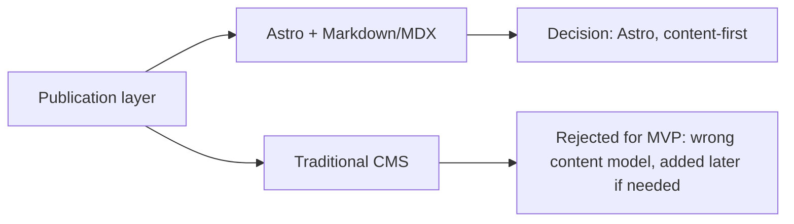

# Tech stack

## Technology choices

| domain | candidates | decision | rationale |
|---|---|---|---|
| site framework | Astro / Next.js / plain static HTML | **Astro** | content-first, assembles pages from Markdown/MDX, interactive components mounted only where needed, primary output is fast static HTML — fits a magazine/archive/special-project shape |
| content storage | Markdown/MDX + TS data files / headless CMS | **Markdown/MDX + TypeScript data files** (`src/content`, `src/data`) | matches the issue/rubric/spread/visual-mode/Nooscope-signal/source-lineage/motion-mode/sound-cue/final-sentence content model — a post/date/author/category CMS model does not fit |
| CMS | Ghost / WordPress / Notion-as-CMS / none at start | **none at start** | pulls the project toward a generic post model too early; add later once an issue rhythm is established — see [[astro-publication-layer]] |

| search | Pagefind / Algolia / none for MVP | **Pagefind, added later** | static-friendly, no backend required, not needed until `/issues` and archive exist |
| deploy target | GitHub Pages / Cloudflare Pages / Netlify / Vercel | **any of the four** (static output, no server requirement) | simple publishing, high speed, low technical fragility, each issue is Git-versionable |
| editorial automation | manual (NotebookLM → Markdown → Astro) / n8n | **n8n**, layered on top of the manual path | becomes the [[n8n-editorial-machine]]; manual path remains the fallback and the only path for final editorial decisions |
| styling | CSS/SVG/Canvas + minimal client JS / heavy JS framework | **CSS/SVG/Canvas, minimal client-side JS** | motion and sound are editorial devices, not app-shell interactivity — see [[visual-system]] |

## Decision mindmap

## Open items

- Pagefind integration timing (tied to Stage 5 — Search + Archive, see root roadmap).
- Real audio loop sourcing for [[visual-system]] sound cues (rights-cleared only).
- Whether n8n later needs a persistent datastore beyond the raw signal inbox, or stays file/Markdown-based throughout.
